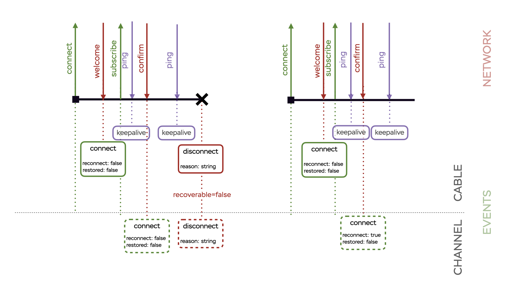

# AnyCable client lifecycle

One of the AnyCable goals is to abstractize away the underlying transport layer (WebSockets), so you don't need to worry about it. However, it might be useful to watch for state updates to provide a better user experience (e.g., show online status or disalbe UI while not connected).

The diagram below demonstrates which events could occur in the system (and what triggers them):



## Cable

### `connect`

The "connect" event is trigger every time a cable connection is established.
You can distinguish initial connection and re-connection by looking at the "reconnect" field.

```js
cable.on('connect', ev => {
  if (ev.reconnect) {
    console.log('Welcome back!')
  } else {
    console.log('Welcome!')
  }
})
```

**NOTE:** A "connect" event also contains the "restored" field, which is reserved for future protocol extensions (and not supported by Rails Action Cable).

### `disconnect`

The "disconnect" event is trigger when the connection was lost
or the server disconnected the client.

**IMPORTANT**: The "disconnect" event implies that a client would try to reconnect (if a monitor is configured or manually).

```js
cable.on('disconnect', ev => {
  if (ev.reason) {
    console.log(`Disconnected because: ${ev.reason}`)
  } else {
    console.log('Disconnected')
  }
})
```

### `close`

The "close" event is similar to "disconnect" with the only difference: it implies that the cable
should not try to reconnect automatically (e.g., when the server sent a disconnect message with `reconnect: false`).

This even is also triggered when a user disonnects the cable intentionally using `cable.disconnect()`. In this case, the event is undefined (since no error happened):

```js
cable.on('close', ev => {
  if (ev) {
    console.log('Something went wrong with the cable', ev)
  } else {
    console.log('Disconnected by us')
  }
})

// This emits event-less 'close'
cable.disconnect()
```

### `keepalive`

The "keepalive" event is trigger every time a server sends a ping message. You can use this event to monitor server-client connectivity yourself.

## Channel

Channels provide the same events as cables except "keepalive" (which is cable-only event): `connect`, `disconnect` and `close`.

The important difference is that the `close` event is only triggered when `channel.disconnect` is called (i.e., when a user intentionally unsubscribed from a channel) or when the `subscribe` commands was rejected by the server or failed unexpectedly. Even if the cable was closed by user (`cable.disconnect()`), the channel stays in the `disconnected` state, not `closed`. That's because whenever the user decides to re-connect (`cable.connect()`), we should restore all unsubscribed channels.

Channels also trigger the "message" event every time a new message is arrived (see the main documentation).

## Unsubscribing from events

We use [nanoevents][] library under the hood, which provides a very minimalistic event dispatching functionality. One of the potential pitfalls could be not managing event subscribers properly. **AnyCable client doesn't clean up event subscriptions automatically**. That's the responsibility of the end user.

Here is an example (using React):

```js
useEffect(() => {
  const channel = consumer.subscribeTo('ChatChannel', { id })
  let unbindOnMessage = channel.on('message', handleMessage)
  return () => {
    unbindOnMessage()
    channel.disconnect()
  }
}, [consumer, id])
```

_Related issues_: [#148](https://github.com/orgs/anycable/discussions/148).

[nanoevents]: https://github.com/ai/nanoevents
